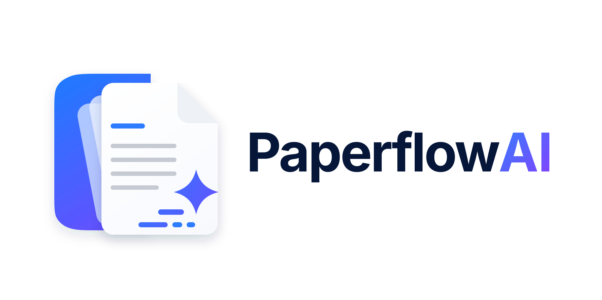

<p align="center">
  <picture>
    <source media="(prefers-color-scheme: dark)" srcset="docs/assets/paperflow-ai-logo-dark.svg">
    
  </picture>
</p>

# Paperflow AI

Paperflow AI is a fork of [paperless-ngx](https://github.com/paperless-ngx/paperless-ngx) that focuses on **AI-assisted document management** while keeping the core "scan, archive, search" workflow that paperless-ngx is known for.

This repository intentionally trims down some of the upstream project’s scope:

- ✅ Keep: core document management, search, tags, web UI
- ✅ Add: AI-powered features (chat over your documents, smarter extraction, Mistral integration)
- ✅ Keep: modern tooling (Python 3.11, `uv`, Docker support)
- ❌ Drop: complex multi-target release packaging and container publishing logic from upstream CI
- ❌ Drop: upstream-specific badges, demo links, and community references

Paperflow AI is **not** a drop-in replacement for paperless-ngx, but a focused fork optimized for experimentation with AI features on top of a solid DMS foundation.

---

## Key differences vs paperless-ngx

Compared to upstream paperless-ngx, Paperflow AI:

- Ships an **agentic dashboard chat** that searches across _all_ your documents
  with tool-driven retrieval and dynamic citations. It is built on upstream's
  llama-index AI stack (`src/paperless_ai/agent_chat.py`) and reuses the same
  streaming protocol as the built-in per-document chat.
- Adds **Mistral** as a first-class backend in upstream's pluggable AI
  configuration: a Mistral **embedding** backend for the semantic index, a
  Mistral **chat** backend for the LLM, and a **Mistral OCR** parser that takes
  priority over Tesseract when configured (and silently falls back to Tesseract
  when it is not).
- Uses **`uv` as the Python dependency manager** for local development and CI.
- Simplifies the **CI pipeline** to focus on static checks and documentation instead of multi-target releases and Docker image publishing.

The goal is to make it easy to:

- Run a personal document archive at home.
- Experiment with new AI-powered extraction, search and chat flows.
- Keep the project maintainable as a smaller fork.

---

## Getting started

The recommended way to run Paperflow AI is via Docker Compose, similar to upstream paperless-ngx.

### Quick start with Docker Compose

From this repository on your server:

```bash
cd paperflow-ai
docker compose build
docker compose up -d
```

`docker compose` uses [docker-compose.yml](docker-compose.yml) by default, which is the **production** deployment (built image, no source mounts, served on host port 8010). The provided `docker-compose.yml` expects environment variables for API keys and secrets (e.g. Mistral, database password). Check the `webserver` service section and configure the relevant variables (preferably via a `.env` file) before running in production.

To run the **development** stack instead (Angular dev server with HMR on `http://localhost:4200`, live source mounts, Django auto-reload), opt in with the dev override:

```bash
docker compose -f docker-compose.yml -f docker-compose.dev.yml up
```

The AI features are configured through these variables (sensible Mistral
defaults are baked into `docker-compose.yml`):

| Variable                             | Purpose                                                                 |
| ------------------------------------ | ----------------------------------------------------------------------- |
| `PAPERLESS_AI_ENABLED`               | Master switch for the AI suite (chat + index).                          |
| `PAPERLESS_AI_LLM_API_KEY`           | API key for the embedding/chat backend (your Mistral key).              |
| `PAPERLESS_AI_LLM_EMBEDDING_BACKEND` | Embedding backend: `mistral`, `openai-like`, `huggingface` or `ollama`. |
| `PAPERLESS_AI_LLM_EMBEDDING_MODEL`   | Embedding model name (e.g. `mistral-embed`).                            |
| `PAPERLESS_AI_LLM_BACKEND`           | Chat LLM backend: `mistral`, `openai-like` or `ollama`.                 |
| `PAPERLESS_AI_LLM_MODEL`             | Chat model name (e.g. `mistral-large-latest`).                          |
| `PAPERLESS_MISTRAL_API_KEY`          | Enables the Mistral OCR parser; unset → Tesseract.                      |
| `PAPERLESS_MISTRAL_MODEL`            | Mistral OCR model (default `mistral-ocr-latest`).                       |

> Note: This fork assumes you are comfortable managing your own Docker deployment. There is no one-line install script or hosted demo like the upstream project.

---

## Development setup (with `uv`)

Paperflow AI uses [`uv`](https://github.com/astral-sh/uv) for Python dependency management and tooling.

### Prerequisites

- Python 3.11
- `uv` installed (`pip install uv` or via your package manager)

### Install dependencies

```bash
cd paperflow-ai
uv sync --dev
```

This will create and manage a virtual environment and install all development dependencies defined in `pyproject.toml`.

### Common tasks

Run tests (if/when they are re-enabled):

```bash
uv run pytest
```

Run the development server (Django):

```bash
cd src
uv run manage.py runserver
```

Lint and format using pre-commit hooks (also used in CI):

```bash
uv run pre-commit run --all-files
```

---

## CI pipeline (fork-specific)

The GitHub Actions workflow in `.github/workflows/ci.yml` has been simplified for this fork:

- ✅ Keep: static checks via `pre-commit`.
- ✅ Keep: documentation build via `mkdocs` (no deploy step).
- ❌ Remove: backend and frontend test matrices that depend on heavy Docker orchestration.
- ❌ Remove: Docker image build & publish and release packaging logic.

This makes the CI pipeline faster and easier to maintain for a personal / small-team fork while still catching obvious issues in pull requests.

---

## Security note

As with upstream paperless-ngx:

> Document scanners are typically used to scan sensitive documents like your social insurance number, tax records, invoices, etc. **Paperflow AI should never be run on an untrusted host** because information is stored in clear text without encryption. No guarantees are made regarding security (but we do try!) and you use the app at your own risk.
>
> **The safest way to run Paperflow AI is on a local server in your own home with backups in place.**

---

## License

Paperflow AI is licensed under the same license as paperless-ngx. See [LICENSE](LICENSE) for details.
